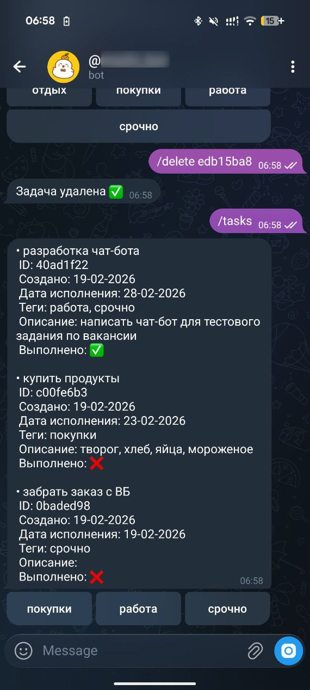

# ToDo Telegram Bot

Бот для управления личными задачами через Telegram с бэкендом на Django и асинхронной обработкой задач через Celery.

---

## 📝 Описание

Проект состоит из двух основных компонентов:

1. **Telegram Bot** (Aiogram + Aiogram-Dialog)
   - Пользователь может:
     - Просматривать свои задачи (`/tasks`)
     - Добавлять задачи (`/add`)
     - Редактировать задачи (`/edit <ID>`)
     - Удалять задачи (`/delete <ID>`)
     - Фильтровать задачи по тегам через кнопки
   - Диалоги реализованы через `aiogram-dialog`, чтобы шаг за шагом собирать данные о задаче (название, описание, теги, дата исполнения).

2. **Backend API** (Django + Django REST Framework)
   - Хранит задачи и пользователей.
   - Поддерживает CRUD операции для задач.
   - Автоматическое создание тегов при добавлении задачи.
   - Возвращает задачи с тегами через API.
   - Асинхронные уведомления о наступлении даты исполнения через Celery + Redis.

---
## 🔧 Архитектура

```text
Telegram Bot (Aiogram)
    ├─ main.py                 # команды и обработка сообщений
    ├─ dialogs.py              # диалоги (Aiogram-Dialog)
    └─ api_client.py           # клиент для взаимодействия с Django API

Backend (Django + DRF)
    ├─ apps/tasks/             # модели Task, Tag, BotUser
    ├─ apps/users/             # кастомная модель пользователя
    ├─ api/serializers.py      # сериализаторы Task/Tag
    ├─ api/views.py            # ViewSet для CRUD задач
    └─ config/celery.py        # конфигурация Celery

Asynchronous Tasks
    └─ Celery + Redis          # уведомления о наступлении даты выполнения
```

---

## 📦 Установка и запуск
В проекте используется Makefile для управления сборкой и запуском.

##### 1. Создайте .env в корне проекта
```bash
POSTGRES_DB=<your_database_name>
POSTGRES_USER=<your_database_user>
POSTGRES_PASSWORD=<your_database_password>
DJANGO_SECRET_KEY=<your_django_secret_key>
BOT_TOKEN=<your_telegram_bot_token>
API_URL=http://backend:8000/api/
```

##### 2. Убедитесь, что Docker и Docker Compose установлены.
##### 3. Запуск проекта через Makefile
```bash
make up
```

##### 4. Остановка сервисов
```bash
make down
```

## 📱 Пример использования в Telegram
